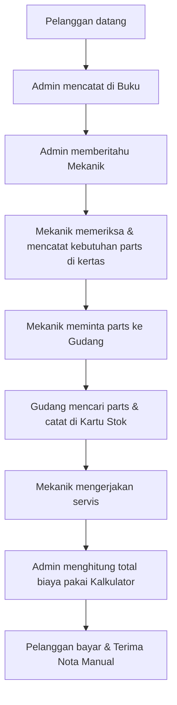
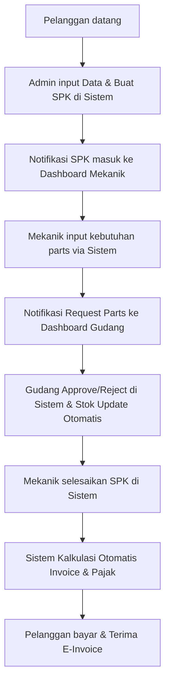
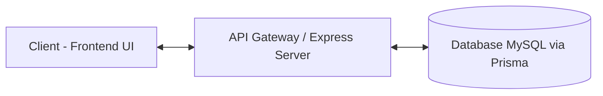
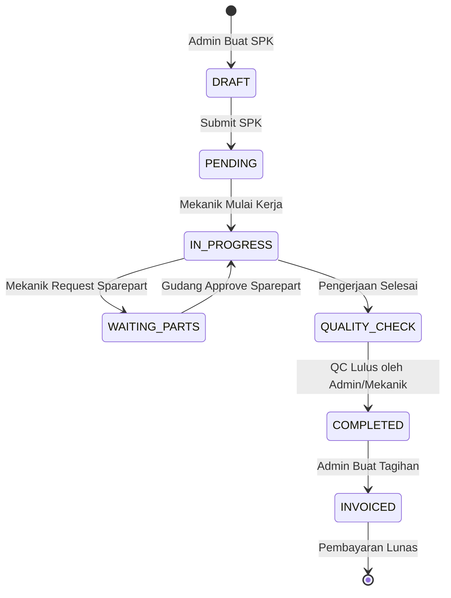
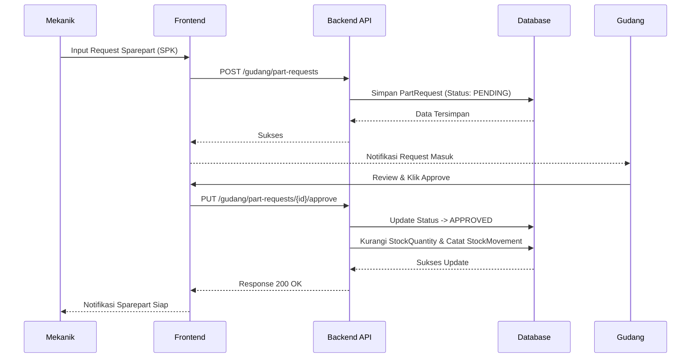
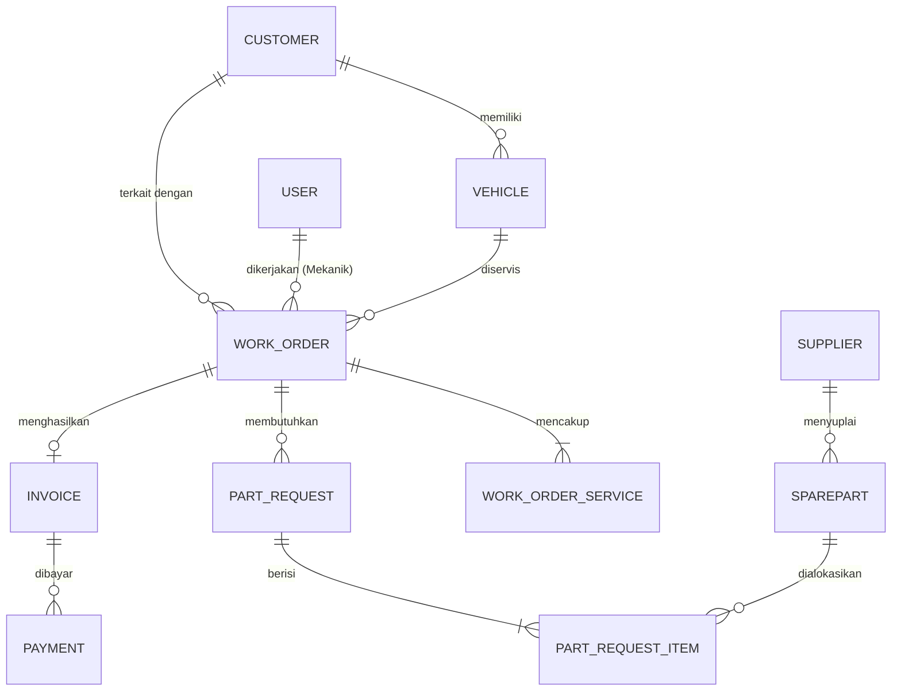

# LAPORAN CAPSTONE PROJECT: AUTO SERVICE SYSTEM

## BAB 1: PENDAHULUAN

**1.1 Latar Belakang**
Sistem manajemen bengkel saat ini masih banyak yang menggunakan metode pencatatan manual berbasis kertas atau *spreadsheet* sederhana. Hal ini sering menimbulkan masalah seperti hilangnya riwayat servis pelanggan, ketidakakuratan stok suku cadang, serta proses pembuatan laporan keuangan yang memakan waktu lama. Inefisiensi ini menurunkan kualitas layanan pelanggan dan menyulitkan pemantauan kinerja operasional secara *real-time*.

**1.2 Rumusan Masalah**
1. Bagaimana merancang sistem pencatatan riwayat servis dan Surat Perintah Kerja (SPK) yang terpusat dan terkomputerisasi?
2. Bagaimana membangun mekanisme manajemen stok suku cadang yang akurat untuk meminimalisir kehilangan dan ketidaksesuaian data?
3. Bagaimana menghasilkan laporan keuangan dan operasional secara otomatis untuk membantu pengambilan keputusan pimpinan?

**1.3 Tujuan Pengembangan**
Mengembangkan aplikasi Auto Service System berbasis web untuk mendigitalisasi seluruh proses operasional bengkel, mulai dari penerimaan kendaraan, alokasi mekanik, pengelolaan suku cadang, hingga proses pembayaran dan pelaporan.

**1.4 Ruang Lingkup dan Batasan Masalah**
* Sistem ini difokuskan pada operasional *front-desk* (Admin), manajemen stok (Gudang), area kerja mekanik (Mekanik), dan pelaporan (Pimpinan).
* Sistem belum mencakup fitur *booking* online untuk pelanggan eksternal dan hanya digunakan secara internal oleh staf bengkel.

**1.5 Pemodelan Proses Bisnis**

* **Flowchart Proses Bisnis Berjalan (Manual)**

> **Penjelasan Flowchart Manual:** Diagram di atas menggambarkan alur kerja tradisional bengkel yang sedang berjalan saat ini. Segala pencatatan, mulai dari pendaftaran pelanggan hingga permintaan suku cadang, dilakukan secara terpisah menggunakan media kertas (Buku Reservasi dan Kartu Stok). Hal ini menyebabkan lambatnya koordinasi antar divisi (Admin, Mekanik, Gudang) dan rentan terhadap kesalahan perhitungan biaya di akhir proses karena rekapitulasi nota masih dilakukan secara manual dengan kalkulator.

* **Flowchart Proses Bisnis Usulan (Sistem Baru)**

> **Penjelasan Flowchart Usulan:** Diagram usulan ini memperlihatkan bentuk otomatisasi alur kerja operasional bengkel setelah perangkat lunak Auto Service System diimplementasikan. Informasi kini mengalir secara digital dan *real-time* dari Admin ke Mekanik dan Gudang melalui masing-masing *Dashboard* perangkat. Sistem mengambil alih proses kalkulasi biaya, penambahan pajak untuk cetak *Invoice*, serta pemotongan jumlah persediaan barang (*stok*), sehingga secara drastis memangkas waktu tunggu (SLA) perbaikan dan meminimalisir kesalahan perhitungan biaya.

---

## BAB 2: TINJAUAN PUSTAKA DAN LANDASAN TEORI

**2.1 Sistem Informasi Manajemen Bengkel**
Sistem informasi manajemen (SIM) bengkel adalah solusi perangkat lunak yang mengintegrasikan pencatatan pelanggan, kendaraan, inventaris, dan transaksi keuangan dalam satu basis data terpusat. SIM bertujuan untuk mengurangi beban administratif, mengurangi *human-error*, serta mempercepat siklus pelayanan dari penerimaan hingga pembayaran.

**2.2 Platform Aplikasi Berbasis Web**
Penggunaan aplikasi berbasis web memungkinkan akses dari berbagai perangkat tanpa instalasi khusus, sehingga mekanik dapat menggunakan tablet/smartphone di area perbaikan, dan admin menggunakan PC kasir dalam jaringan yang sama. Arsitektur ini mengurangi biaya *maintenance* karena pembaruan sistem hanya perlu dilakukan di sisi server.

**2.3 Teknologi Frontend & Backend**
Sistem ini menggunakan *stack* teknologi modern untuk menjamin performa tinggi:
* **Backend:** *Node.js* dengan *framework Express.js* dan dikembangkan menggunakan bahasa *TypeScript* untuk *type-safety*.
* **ORM:** *Prisma ORM* digunakan sebagai jembatan antara *object-oriented backend* dengan *relational database*, mempermudah *query* data yang kompleks dan menjaga *schema consistency*.
* **Frontend:** Framework berbasis komponen modern (React/Vue/Angular) digunakan untuk membangun *Single Page Application* (SPA) yang dinamis, responsif, dan interaktif.

**2.4 Sistem Basis Data (RDBMS)**
Pengelolaan data menggunakan *Relational Database Management System* (MySQL) untuk menjamin integritas data (*ACID compliance*). Basis data relasional sangat ideal karena sistem manajemen bengkel memiliki tingkat ketergantungan entitas yang tinggi (contoh: *Work Order* terhubung ke *Customer*, *Vehicle*, *User/Mechanic*, *Services*, dan *Spareparts*).

**2.5 Arsitektur RESTful API**
Sistem menerapkan pola arsitektur *Representational State Transfer* (REST) di mana *Frontend* dan *Backend* terpisah (*decoupled*). Komunikasi dilakukan via format JSON (JavaScript Object Notation). Pendekatan ini memungkinkan *backend* untuk digunakan ulang (*reusable*) jika nantinya bengkel membutuhkan aplikasi *mobile native* atau integrasi ke *platform* lain.

---

## BAB 3: ANALISIS DAN PERANCANGAN SISTEM

**3.1 Analisis Pengguna (Aktor)**
Sistem mengadopsi konsep *Role-Based Access Control* (RBAC) dengan 4 aktor:
* **Admin**: Mengelola pendaftaran pelanggan, kendaraan, pembuatan Work Order (SPK), pembuatan *Invoice*, dan penerimaan pembayaran.
* **Mekanik**: Menerima penugasan SPK, mengubah status pengerjaan, mencatat layanan, dan mengajukan *Part Request*.
* **Gudang**: Mengelola inventaris, memantau pergerakan stok (*Stock Movement*), dan memvalidasi permintaan suku cadang mekanik.
* **Pimpinan**: Mengakses *dashboard* analitik, laporan pendapatan, performa mekanik, dan visibilitas persediaan operasional.

**3.2 Arsitektur Sistem**

> **Penjelasan Arsitektur Sistem:** Arsitektur Auto Service System dibangun menggunakan model modern *Client-Server* berbasis API (*Application Programming Interface*). Modul *Frontend UI* bertindak sebagai sisi klien yang diakses oleh pengguna melalui *web browser*. Klien melakukan pertukaran data (HTTP/REST) dengan *Backend API Gateway* (Node.js) yang mengeksekusi logika bisnis aplikasi. Sementara itu, *Backend Server* adalah satu-satunya entitas yang diizinkan untuk berinteraksi dengan Database MySQL melalui *Prisma ORM*, guna menjamin keamanan, pemusatan validasi, dan perlindungan dari SQL Injection.

**3.3 Perancangan Model Fungsional**
* **Use Case Diagram**
```mermaid
usecaseDiagram
    actor Admin
    actor Mekanik
    actor Gudang
    actor Pimpinan

    usecase "Kelola Data Pelanggan & Kendaraan" as UC1
    usecase "Buat dan Kelola Work Order (SPK)" as UC2
    usecase "Proses Pembayaran & Invoice" as UC3
    usecase "Kerjakan SPK & Update Status" as UC4
    usecase "Request Sparepart" as UC5
    usecase "Kelola Stok & Master Barang" as UC6
    usecase "Approve Request Sparepart" as UC7
    usecase "Lihat Laporan & Dashboard" as UC8

    Admin --> UC1
    Admin --> UC2
    Admin --> UC3
    Admin --> UC8

    Mekanik --> UC4
    Mekanik --> UC5

    Gudang --> UC6
    Gudang --> UC7
    
    Pimpinan --> UC8
```
> **Penjelasan Use Case Diagram:** Diagram *Use Case* di atas memetakan dengan jelas hak akses dan peruntukan modul bagi 4 (empat) peran (*Roles*) pengguna sistem. Admin difokuskan pada manajemen registrasi dan transaksi administrasi (pelanggan, SPK, dan kasir). Mekanik memiliki antarmuka khusus untuk mengeksekusi SPK dan melakukan permintaan suku cadang (*Request Sparepart*). Aktor Gudang bertindak sebagai *gatekeeper* untuk merawat master data barang dan menyetujui mutasi stok dari mekanik. Pimpinan bengkel diberikan hak istimewa *Read-Only* secara menyeluruh untuk memantau aktivitas sistem dari layar *Dashboard* laporan. Pembagian use case ini mengadopsi prinsip *Separation of Duties* (Pemisahan Tugas) secara ketat.

**3.4 Pemodelan Alur Aktivitas (Logika Bisnis)**
* **Activity Diagram: Alur Kerja SPK (Work Order)**

> **Penjelasan Activity/State Diagram SPK:** Alur aktivitas di atas menggambarkan *State Machine* (Siklus Transisi Status) dari sebuah Surat Perintah Kerja (SPK). Dokumen SPK bermula dalam *state* `DRAFT` saat disusun oleh admin, kemudian beralih menjadi `PENDING` saat di-*submit* agar dapat dilihat oleh mekanik terkait. Ketika dieksekusi, status berubah menjadi `IN_PROGRESS`. Apabila proses terhenti karena ketiadaan komponen, status dapat diturunkan sementara ke `WAITING_PARTS` hingga di-setujui oleh gudang. Melalui mekanisme status ini, admin depan (kasir) dapat melacak secara akurat apakah kendaraan pelanggan sudah selesai `COMPLETED` dan siap masuk tahap pembuatan tagihan kasir `INVOICED`.

**3.5 Pemodelan Interaksi Sistem**
* **Sequence Diagram: Pengajuan Sparepart (Part Request)**

> **Penjelasan Sequence Diagram:** Diagram urutan (*Sequence*) ini membongkar komunikasi interaktif secara linier (berdasarkan waktu) di balik sistem ketika Mekanik mengajukan *request sparepart* kepada Gudang. Dimulai saat antarmuka (UI) mekanik mengirim *request* POST jaringan ke Backend API, yang di-translasi menjadi injeksi ke *Database* (berstatus `PENDING`). Saat aktor Gudang menerima notifikasi dan memberikan klik "Approve", API menjalankan transaksi basis data (*Transaction*). Sistem API tidak hanya memperbarui status komponen yang disetujui, melainkan secara paralel melakukan perhitungan minus/pengurangan atribut `StockQuantity` dan melahirkan record log baru ke dalam tabel `StockMovement` (Riwayat Pergerakan Barang).

**3.6 Perancangan Basis Data (ERD)**

> **Penjelasan Entity Relationship Diagram (ERD):** Model konseptual basis data ini mendefinisikan rancangan relasi antar entitas bisnis. Tabel utama `WORK_ORDER` bertindak sebagai sentral penghubung (Kardinalitas *Many-to-One*) yang mengikat identitas tabel `CUSTOMER` (Pemilik), `VEHICLE` (Kendaraan yang diservis), dan `USER` (Mekanik yang ditugaskan). Setiap pengajuan alat dan suku cadang untuk sebuah `WORK_ORDER` dikelompokkan ke dalam `PART_REQUEST` (Tabel Transaksi Header) yang berisi beberapa `PART_REQUEST_ITEM` (Transaksi Detail) di mana berelasi secara langsung ke master tabel `SPAREPART`. Relasi ini memastikan berlakunya integrasi relasional, sehingga sistem tidak mengizinkan adanya penghapusan pelanggan (`CUSTOMER`) atau kendaraan (`VEHICLE`) secara paksa apabila riwayat tagihan SPK dan `INVOICE` mereka masih tersimpan di dalam sistem.

---

## BAB 4: IMPLEMENTASI DAN PENGUJIAN

**4.1 Lingkungan Implementasi**
* **Hardware Server**: Cloud VPS (Minimal 2 vCPU, 4GB RAM).
* **Hardware Klien**: PC/Laptop Kasir, Tablet untuk area teknis.
* **Software**: Sistem Operasi Linux (Server), Node.js (v18+), Prisma ORM, MySQL (v8+).

**4.2 Implementasi Antarmuka (UI/UX)**
*(Tempatkan tangkapan layar sistem sebenarnya di bagian ini. Tambahkan narasi singkat untuk tiap screenshot, seperti: "Gambar 4.1. Halaman Dashboard Admin yang menampilkan matriks Work Order hari ini dan peringatan stok menipis.")*

**4.3 Pengujian Sistem (Black Box Testing)**
Pengujian dilakukan untuk memvalidasi fungsionalitas utama aplikasi berdasarkan skenario *input* yang diberikan.

| ID | Fitur / Skenario Pengujian | Input/Kondisi Prasyarat | Hasil yang Diharapkan | Status |
|:---|:---------------------------|:------------------------|:----------------------|:-------|
| TC-01 | **Login Auth** - Akses dengan kredensial salah | Email / password tidak cocok dengan DB | Sistem menolak login dan menampilkan error *Invalid Credentials* | Valid |
| TC-02 | **Role Access** - Akses URL di luar otorisasi | Mekanik mencoba mengakses `/invoices` | Middleware mengembalikan *Error 403 Forbidden* | Valid |
| TC-03 | **Registrasi Pelanggan** - Validasi nomor telepon | Form *phone* berisi huruf | API menolak input dan form memunculkan peringatan invalid | Valid |
| TC-04 | **Pembuatan SPK** - SPK tanpa kendaraan | Admin submit WO tanpa memilih *Vehicle ID* | Gagal disimpan, *bad request exception* karena data tidak lengkap | Valid |
| TC-05 | **Part Request** - Mekanik minta stok berlebih | Jumlah permintaan mekanik (10) > Stok gudang (5) | Sistem menolak proses approve / memberi tahu stok kurang | Valid |
| TC-06 | **Approval Gudang** - Mutasi Stok Otomatis | Gudang klik *Approve* pada *Part Request* | Stok suku cadang utama di DB berkurang presisi | Valid |
| TC-07 | **Approval Gudang** - Audit *Stock Movement* | Part berhasil di-*approve* | *Database* berhasil mencatat *log* mutasi *stock-out* otomatis | Valid |
| TC-08 | **Tagihan Kasir** - Kalkulasi Grand Total otomatis | Invoice dihasilkan dari SPK (Servis + Parts) | *Grand total* terkalkulasi: *(Service + Part) - Diskon + Pajak* dengan benar | Valid |

---

## BAB 5: DOKUMENTASI MANAJEMEN PROYEK

**5.1 Pembagian Tugas Tim**
Proyek ini mengadopsi model *Scrum Team* dengan pembagian tugas fungsional sebagai berikut:

| Peran (Role) | Tanggung Jawab Utama |
|:-------------|:---------------------|
| **Project Manager/Scrum Master** | Menjaga jadwal pengerjaan, fasilitasi *sprint*, dan komunikasi *stakeholder*. |
| **Backend Developer** | Merancang API, *Database Schema*, implementasi autentikasi, serta logika bisnis (kalkulasi stok/tagihan). |
| **Frontend Developer** | Merancang *User Interface*, melakukan *API integration*, pengelolaan *State Management*. |
| **QA / System Analyst** | Menyusun BPMN, melakukan *testing* (TC), dokumentasi laporan Capstone, dan *user manual*. |

**5.2 Metode Pengembangan (Agile Scrum)**
Pengembangan dilaksanakan menggunakan pendekatan *Agile Scrum* untuk memberikan iterasi *software* yang berfungsi setiap pekannya, mencakup:
* **Sprint Planning**: Menentukan prioritas fitur dari *Product Backlog* untuk dieksekusi dalam satu siklus (1-2 minggu).
* **Daily Standup**: Sinkronisasi progres harian antar tim untuk memecahkan hambatan (*blockers*).
* **Sprint Review**: Mendemonstrasikan sub-modul (contoh: Modul Kasir) yang sudah *deployable* kepada dosen pembimbing.
* **Sprint Retrospective**: Evaluasi efisiensi internal kerja tim pasca sprint.

**5.3 Jadwal Pengembangan (12 Minggu)**

| Fase Sprint | Fokus Pengerjaan | Output / Deliverables |
|:---|:---|:---|
| **Minggu 1-2** | *Requirement & System Design* | Latar belakang, Dokumen BPMN, ERD, dan Mockup UI Figma. |
| **Minggu 3-4** | *Setup & Database Schema* | Inisialisasi arsitektur, Skema Prisma, *API Authentication*. |
| **Minggu 5-6** | Modul Master Data | CRUD Pelanggan, Kendaraan, Pengguna, dan Master Jasa. |
| **Minggu 7-8** | Modul SPK & Mekanik | Modul pembuatan *Work Order* & Kanban Board Mekanik. |
| **Minggu 9-10**| Modul Gudang & Kasir | *Part Request*, otomatisasi mutasi stok, modul Invoice & kalkulasi pembayaran. |
| **Minggu 11**  | *Testing & Bug Fixing* | *Black box testing* komprehensif, optimasi validasi form, perbaikan *edge-cases*. |
| **Minggu 12**  | *Deployment & Documentation* | Pengumpulan Laporan Capstone Project dan *deploy production* (hosting). |

**5.4 Manajemen Risiko Proyek**

| Identifikasi Risiko (Ancaman) | Dampak | Probabilitas | Tindakan Mitigasi |
|:---|:---|:---|:---|
| Miskomunikasi payload *Frontend-Backend* | Tinggi | Sedang | Merancang *API Contract* (seperti Swagger) di awal dan disetujui kedua belah pihak. |
| Kehilangan atau Konflik *Source Code* | Sangat Tinggi | Rendah | Implementasi kontrol versi menggunakan *Git* dengan aturan perlindungan *branch main*. |
| Kalkulasi total pembayaran (*Invoice*) meleset | Tinggi | Sedang | Menempatkan seluruh logika aritmatika biaya (*discount, tax, total*) secara terpusat di ranah *Backend* saja. |
| Kerusakan / Hilangnya Data di Database | Ekstrem | Rendah | Mengaktifkan *Automated Database Backup* secara harian pada penyedia layanan infrastruktur. |

---

## BAB 6: PENUTUP

**6.1 Kesimpulan**
Sistem Auto Service telah berhasil diimplementasikan dan mampu menjawab tantangan operasional bengkel dengan mendigitalisasi proses administrasi, manajemen stok inventaris secara *real-time*, dan pencatatan transaksi SPK (*Work Order*) hingga tagihan (*Invoice*) yang sistematis dan transparan.

**6.2 Saran**
Sistem dapat dikembangkan lebih lanjut di masa depan dengan menambahkan fitur notifikasi *WhatsApp Gateway* (melengkapi modul notifikasi internal yang sudah ada) ke perangkat pribadi pelanggan saat servis selesai, serta mengintegrasikan *payment gateway* (*e-Wallet / Virtual Account*) untuk pembayaran *seamless*.
